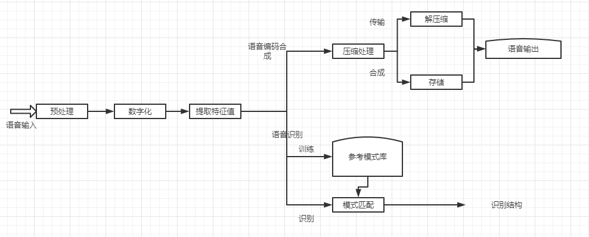
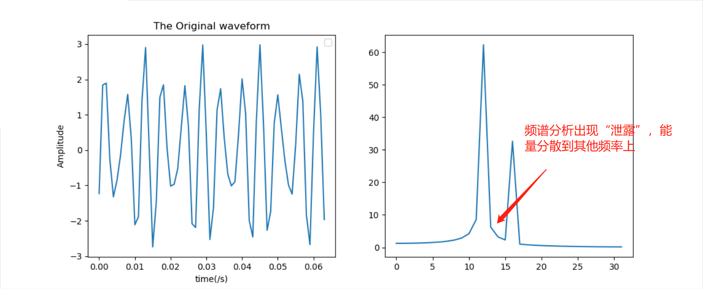
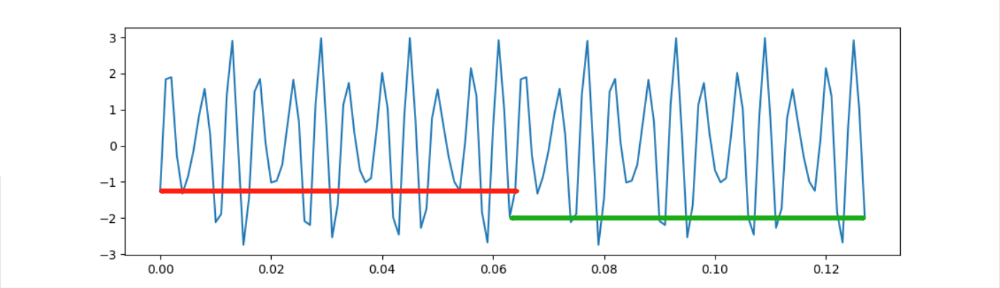
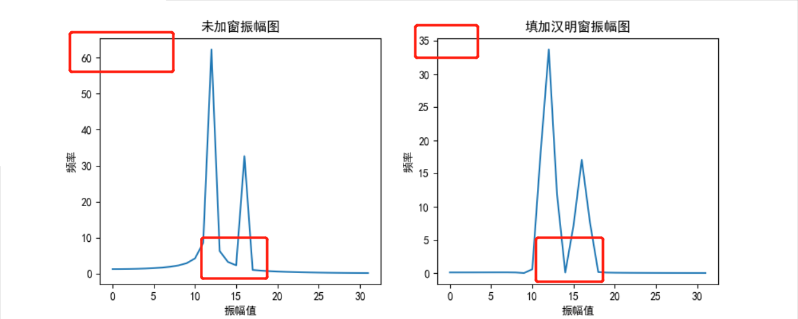
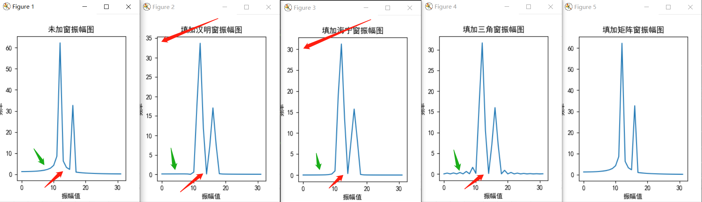
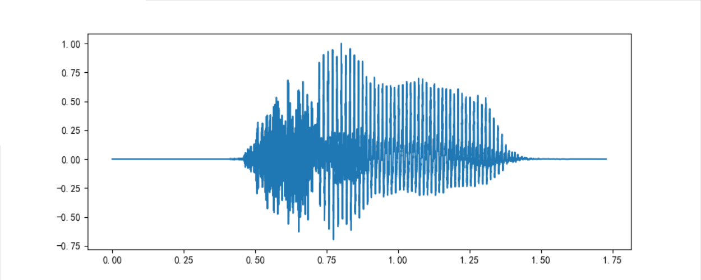
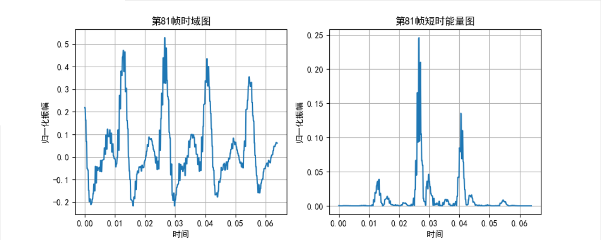

# 数字语音识别

---
### 概念
所有信号都是若干正弦波的和

> 元音：气流呼出口腔时不受到阻碍的音
>
> 辅音：气流受到口腔或者鼻腔阻碍的音；
>
> 清音：声带不震动的音
>
> 浊音：声带振动的音
>
> 元音都是浊音，辅音分为清辅音和浊辅音。

语音短时能量：计算较短时间内的语音能量。即为一帧时间内的语音能量，语音的短时能量就是将语音中每一帧的短时能量都计算出来，然后我们就可以利用这个短时能量数组做很多事情。

>Wave格式:(是一种RIFF文件)
>
>       前一部分:文件头
>       后一部分:数据块

语音信号处理的总体结构:



----

```
时域: 
    是根据时间变化的电压值(是信号在时间轴随时间变化的总体概括)
    横轴是时间,纵轴是信号的变化

频域: 
    不同频率对应的电压
    横轴是频率,纵轴是该频率信号的幅度
```
[频域及时域](https://blog.csdn.net/u010029439/article/details/103435651?utm_medium=distribute.pc_relevant.none-task-blog-baidujs_baidulandingword-0&spm=1001.2101.3001.4242)


----
### 原理
1. 预处理
-
    a)分帧处理
        
        1. 数据读取、数据归一化(避免不同的单位量纲，提高收敛的稳定性)
            归一化方法：
                min_max标准化方法:y = (x-min)/(max-min)
                Z-score标准化方法:y = (x-均值)/标准差
                极大值: y = x/max(abs(data))
                
    
    时域图
              
        2. 计算帧的个数:
            wlen帧长和帧移可以控制(寻求最佳值)
        
            wlen为帧长，inc为帧移，重叠部分为overlap，overlap=wlen - inc
            fn  = (N−overlap)/inc
                = (N−wlen)/inc+1
                = (N-wlen+inc)/inc
    
    关于sin帧的计算(解释)
            
        3. 得到帧信号
            1) 用0补齐帧 ---> a矩阵
            2) 得到时间抽取矩阵 ----> time矩阵
            3) 得到帧信号(利用) ----> a[time] 数组中的一行为一帧
    
    
     分帧后第420帧
               
        4. 信号加窗
            1) 为什么要加窗？
                FFT假设输入信号是整数个周期信号。如果输入信号满足条件，则不需要加窗。但实际上这两个条件几乎不能满足，FFT的这个假设会导致频谱泄露，为了减少频谱泄露需要用到窗函数。
                FFT要求时间从负无穷到正无穷的积分，所以需要进行延拓。
                   将真实数据无线延长，最后点连接最开始的点，可能出现不连续现象
     
    
    > 四种窗函数 
    [代码](../test2/5.py)       
     
            2) 频谱泄漏现象?
                频谱泄漏是没有截取整数倍周期信号造成的，这时候频谱会受到截断窗频谱的卷积，可以类比为通过了一个信道，其冲激响应导致频谱尖峰模糊不清。
     
     
     频谱泄露       [代码](../test2/频谱泄露.py)
     ```
        (取帧长为64， 帧移为32，采样频率1000， 时间：1s)
        采样函数:sin(2π*250*t) + sin(2π*185.5*t)
        频谱图:未归一化、未取半处理、未加窗
     ```
     
     
     第三帧循环一帧      [代码](../test2/6.py)
     
     ```这种非整周期的截断导致延拓信号与原信号相位不连续，这是产生频谱泄漏的主要原因```
            
            3) 加窗
                在傅里叶积分中，将原来的被积函数与特定的窗函数做积
    
    
    添加汉明窗   [代码](../test2/加窗处理.py)
    ```
      加窗减少在非整数个周期上进行FFT产生的误差，
      数字化仪采集到的有限序列的边界会呈现不连续性。
      加窗可减少这些不连续部分的幅值。 
      加窗包括将时间记录乘以有限长度的窗，窗的幅值逐渐变小，在边沿处为0。 
      加窗的结果是尽可能呈现出一个连续的波形，减少剧烈的变化。
      增加旁瓣的跌落速率，可减少频谱泄漏。
    ```
    
    
    四种窗函数的比较   [代码](../test2/加窗处理2.py)
    ```
        (取帧长为64， 帧移为32，采样频率1000， 时间：1s)
        采样函数:sin(2π*250*t) + sin(2π*185.5*t)
        未归一化处理
       1. 汉明窗与海宁窗:汉明窗的幅值更大一些
       2. 三角窗和汉明窗与海宁窗: 三角窗边沿幅值不为0
       3. 矩形窗对采样函数没有明显效果
    ```
    
    
    
            4) 频谱分析
                fs : 信号的采样频率
                N  : 采样点数(频谱分析和FFT计算的点数)
                Delta t : 采样时间间隔
                T : 时域截断窗长
                Delta f : 频率分辨率(频谱中相邻两条谱线间的频率间隔)
                fs = 1/Delta t
                Delta f = fs/N = fs/(T*fs) = 1/T
                
                经过FFT得到的振幅谱的振幅很大，而且具有对称性。
                    可以利用取一半和归一化处理.
                        Y = A * sin(2π*t*f)
                    每个峰值的模是A的N/2倍(N为采样点)

-                
    
    ###### 图像为y=0.7*sin(2π*50*t)+sin(2π*120*t) 及其振幅谱(双边振幅谱[未归一])
    [代码](../test2/频谱图.py)
    
    ![图像为y=0.7*sin(2π*50*t)+sin(2π*120*t) 及其振幅谱(双边相位谱[未归一])](./img/函数相位谱.png)
    ###### 图像为y=0.7*sin(2π*50*t)+sin(2π*120*t) 及其相位谱(双边相位谱[未归一])
    [代码](../test2/频谱图.py)
                                                                                                                                                                                                                                                                                                                                                                                                                                                                                                                                                                                                                                                                                                                                                                                                                                                                                                                                                                                                                                                                                                                                                                                                                                                                                                                                                                                                                                                                                                                                                                                                                          
    
    ###### 振幅谱进行归一化和取半处理
    [代码](../test2/频谱图.py)
    
    
    > sinx函数及其FFT频谱
    [代码](../test2/5.py)


-     
    b)端点检测(双门限法)
        
        端点检测就是为了从带有噪声的语音中准确的定位出语音的开始点，和结束点，去掉静音的部分，去掉噪声的部分，找到一段语音真正有效的内容
        1. 双门限法主要是用短时能量和短时过零率        
        2. 短时能量用于区分浊音(高能量)和清音(低能量)
        3. 短时过零率用于区分清辅音(高)和静音(低)
        
    
    语音11.wav时域图 [代码](../test2/帧数全图.py)
    
    
    第81帧短时能量图 [代码](../test2/短时能量.py)
    
    E_{n} = \sum_{m=-\infty }^{+\infty} [x(m)^{2}w(n-m)]^{2}
    ```
    语音能量的计算:E = x(n)^2
    定义n时刻某语音信号的短时平均能量E为:
        En = ∑[x(m)w(n-m)]^2 = x(n)^2*h(n), 其中,h(n) = w(n)^2, w(n)是窗函数
           
 
    短时能量主要用于区分浊音段和清音段,因为浊音时E(i)值比清音时大得多;
    区分声母与韵母的分界和无话段与有话段分界。
  
    短时能量即一帧时间内的语音能量就是短时能量，语音的短时能量就是将语音中每一帧的短时能量都计算出来，
    然后我们就可以利用这个短时能量数组做很多事情了
    ```
    
    
    
        
    
       
---
### 方案
1. 预处理
2. 特征提取

    a)MFCC
3. 模式匹配

    a)DTW算法        
        
        
        
        
        
        
        
        
        
        
        
        
        
        
        
