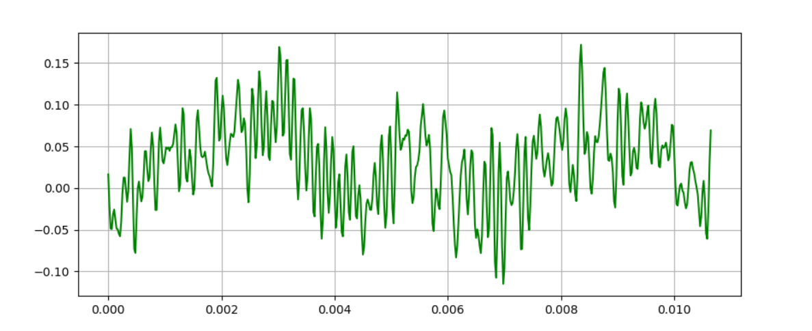

# 数字语音识别

---
### 概念
所有信号都是若干正弦波的和

> 元音：气流呼出口腔时不受到阻碍的音
>
> 辅音：气流受到口腔或者鼻腔阻碍的音；
>
> 清音：声带不震动的音
>
> 浊音：声带振动的音
>
> 元音都是浊音，辅音分为清辅音和浊辅音。

语音短时能量：计算较短时间内的语音能量。即为一帧时间内的语音能量，语音的短时能量就是将语音中每一帧的短时能量都计算出来，然后我们就可以利用这个短时能量数组做很多事情。

>Wave格式:(是一种RIFF文件)
>
>       前一部分:文件头
>       后一部分:数据块

----

```
时域: 
    是根据时间变化的电压值(是信号在时间轴随时间变化的总体概括)
    横轴是时间,纵轴是信号的变化

频域: 
    不同频率对应的电压
    横轴是频率,纵轴是该频率信号的幅度
```
[频域及时域](https://blog.csdn.net/u010029439/article/details/103435651?utm_medium=distribute.pc_relevant.none-task-blog-baidujs_baidulandingword-0&spm=1001.2101.3001.4242)


----
### 原理
1. 预处理
-
    a)分帧处理
        
        1. 数据读取、数据归一化(避免不同的单位量纲，提高收敛的稳定性)
            归一化方法：
                min_max标准化方法:y = (x-min)/(max-min)
                Z-score标准化方法:y = (x-均值)/标准差
                极大值: y = x/max(abs(data))
                
    
    时域图
              
        2. 计算帧的个数:
            wlen帧长和帧移可以控制(寻求最佳值)
        
            wlen为帧长，inc为帧移，重叠部分为overlap，overlap=wlen - inc
            fn  = (N−overlap)/inc
                = (N−wlen)/inc+1
                = (N-wlen+inc)/inc
    
    关于sin帧的计算(解释)
            
        3. 得到帧信号
            1) 用0补齐帧 ---> a矩阵
            2) 得到时间抽取矩阵 ----> time矩阵
            3) 得到帧信号(利用) ----> a[time] 数组中的一行为一帧
    
    
     分帧后第420帧
               
        4. 信号加窗
            1) 为什么要加窗？
                FFT假设输入信号是整数个周期信号。如果输入信号满足条件，则不需要加窗。但实际上这两个条件几乎不能满足，FFT的这个假设会导致频谱泄露，为了减少频谱泄露需要用到窗函数。
                FFT要求时间从负无穷到正无穷的积分，所以需要进行延拓。
                   将真实数据无线延长，最后点连接最开始的点，可能出现不连续现象
            
            2) 频谱泄漏现象?
                频谱泄漏是没有截取整数倍周期信号造成的，这时候频谱会受到截断窗频谱的卷积，可以类比为通过了一个信道，其冲激响应导致频谱尖峰模糊不清。
                      
            3) 加窗
                在傅里叶积分中，将原来的被积函数与特定的窗函数做积
              
            4) 频谱分析
                fs : 信号的采样频率
                N  : 采样点数(频谱分析和FFT计算的点数)
                Delta t : 采样时间间隔
                T : 时域截断窗长
                Delta f : 频率分辨率(频谱中相邻两条谱线间的频率间隔)
                fs = 1/Delta t
                Delta f = fs/N = fs/(T*fs) = 1/T
                
                经过FFT得到的振幅谱的振幅很大，而且具有对称性。
                    可以利用取一半和归一化处理.
                        Y = A * sin(2π*t*f)
                    每个峰值的模是A的N/2倍(N为采样点)
                
    
    ###### 图像为y=0.7*sin(2π*50*t)+sin(2π*120*t) 及其振幅谱(双边振幅谱[未归一])
    [代码](../test2/频谱图.py)
    
    ![图像为y=0.7*sin(2π*50*t)+sin(2π*120*t) 及其振幅谱(双边振幅谱[未归一])](./img/函数相位谱.png)
    ###### 图像为y=0.7*sin(2π*50*t)+sin(2π*120*t) 及其振幅谱(双边振幅谱[未归一])
    [代码](../test2/频谱图.py)
                                                                                                                                                                                                                                                                                                                                                                                                                                                                                                                                                                                                                                                                                                                                                                                                                                                                                                                                                                                                                                                                                                                                                                                                                                                                                                                                                                                                                                                                                                                                                                                                                              
    
    ###### 振幅谱进行归一化和取半处理
    [代码](../test2/频谱图.py)
    
    
    > 四种窗函数 
    [代码](../test2/5.py)

    
    > sinx函数及其FFT频谱
    [代码](../test2/5.py)


-     
    b)端点检测(双门限法)

        1. 双门限法主要是用短时能量和短时过零率        
        2. 短时能量用于区分浊音(高能量)和清音(低能量)
        3. 短时过零率用于区分清辅音(高)和静音(低)
        
---
### 方案
1. 预处理
2. 特征提取

    a)MFCC
3. 模式匹配

    a)DTW算法        
        
        
        
        
        
        
        
        
        
        
        
        
        
        
        
